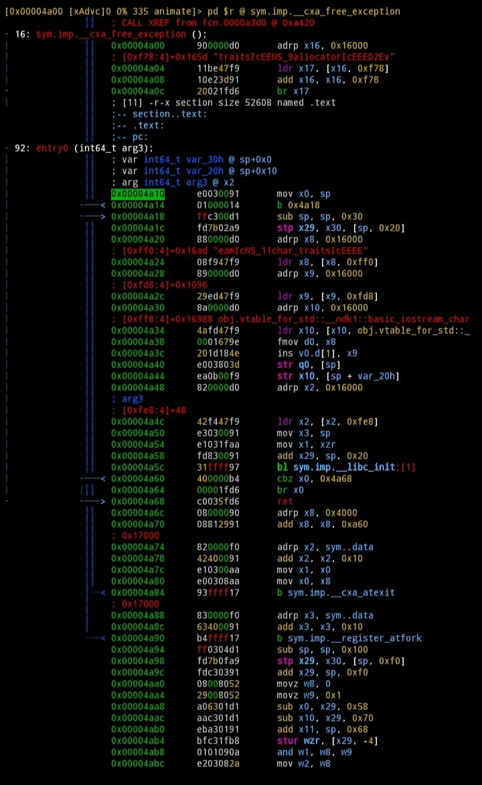

# 🎄All in one professional hacking tool installer kit!!!🎄

### If you know how to use it and you are enough smart then you can hack anything.. like facebook, Instagram, websites, anything....

### 🎉 Tutorials Inside... 🎉

[](LICENSE)
[]()

[](https://nasa.gov)
[]()
[](https://google.com)
[]()
[]()
[]()

## Demonstration Termux Root
[]()
[]()
[]()

## Menu :
+ Information Gathering
+ Password Attacks
+ Wireless Testing
+ Exploitation Tools
+ Sniffing & Spoofing
+ Web Hacking
+ Private Web Hacking
+ Post Exploitation
+ Carding

### Information Gathering:
+ SherlockHomies
+ Whois
+ IP Reverse
+ Subdomain Finder
+ SayCheese
+ Nmap
+ Setoolkit
+ Port Scanning
+ Host To IP
+ wordpress user
+ CMS scanner
+ XSStrike
+ Dork - Google Dorks Passive Vulnerability Auditor
+ Scan A server's Users
+ Crips

### Password Attacks:
+ Cupp
+ Ncrack
+ Hash Cat
+ Wordpress Password Quick Hash
+ Hash Analyzer
+ Wireless Testing:
  + reaver
  + pixiewps
  + Fluxion
  + asscrack-nigger
  + Aircrack-ng
  + Chain & Abel
  + Wlan666mon
  + Wifipisher
  + ARP Poison
  + WifiCutter
  + KickThemOut
### Exploitation Tools:
+ ATSCAN
+ sqlmap
+ Shellnoob
+ commix
+ FTP Auto Bypass
+ jboss-autopwn
+ SS7 exploit
+ Termux Root (Nougat, Marsmellow, Oreo, Pie, Jelly Bean)
+ Root Linux Web Kernel (3.x - 5.7)

### Sniffing & Spoofing:
+ Tshark
+ Burpsuite Enterprise Pro
+ Setoolkit
+ SSLtrip
+ SSLStripper
+ pyPISHER
+ Web Hacking:
  + Drupal Hacking
  + Inurlbr
  + Wordpress & Joomla Scanner
  + Gravity Form Scanner
  + File Upload Checker
  + Wordpress Themes Scanner
  + Wordpress Plugins Scanner
  + Shell and Directory Finder
  + Joomla! 1.5 - 3.4.5 remote code execution
  + Vbulletin 5.X remote code execution
  + BruteX - Automatically brute force all services running on a target
  + Arachni - Web Application Security Scanner Framework

### Private Web Hacking:
+ Backdoor
  + Hmei7 Priv8
  + B374K (Final Mods)
  + IndoXploit V3
  + Marijuana Shell (Mods 400 Bypass)
+ Get all websites
+ Get joomla websites
+ Get wordpress websites
+ Control Panel Finder
+ Zip Files Finder
+ Upload File Finder
+ Get server users
+ SQli Scanner
+ Ports Scan (range of ports)
+ ports Scan (common ports)
+ Get server Info
+ Bypass Cloudflare
+ Acunetix
+ ZAP
+ Joomla CSRF
+ Git Dotdir Scanner
+ Auto Domain Hijack
+ SMTP Crack
+ Cpanel Crack
+ WHM Crack
+ HeartBleed
+ SQLiv
+ sqlDump

### Post Exploitation:
+ Shell Checker
+ POET
+ Weeman
+ Wordpress Brute xmlrpc.php

### Carding
* Mailer Multi Threads
* Sql Dump Mail List
* Paypal True Login
  * Scampages
  * Letter Bypass Inbox
* Apple True Login
  * Scampages
  * Letter Bypass Inbox
* RDP carding and cracking
  * Amazon Web Services (AWS)
  * Microsoft Azure
  * Google cloud
* All account cracking tools
  * Netflix
  * Amazon Prime
  * Spotify
  * Premium VPNs
  * and much more!! 🤑


## 🎁And much more.........🎁


## Installation in Kali Linux :

```
git clone https://github.com/erwincatt/hackingtool
```

```sh
cd hackingtool
```

```sh
chmod 777 install.sh
```

```sh
./install.sh
```

That's it..

## Installation in Android Termux :
Open Termux

```sh
termux-setup-storage
```

```sh
pkg install git
```
```sh
git clone https://github.com/erwincatt/hackingtool
```

```sh
cd hackingtool
```

```sh
chmod 777 install.sh
```

```sh
./install.sh
```
